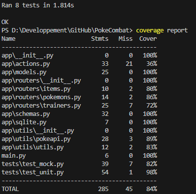

# EXAMEN TEST

## Thibault Scorielle
## Dimitri Perreaux
## Jeremie Felin

# Partie CODE
## Génération de données pour la BdD
Création de 3 scripts pour peupler la base de donnée. Ils se trouvent dans le package generateData et portent le nom de generateTrainers.py, generatePokemon.py, generateItems.py. 
* generateTrainer.py nous permet de générer 3 dresseurs dans la table trainers écrit en dur dans le code, ils sont composé d'un nom et d'une date d'anniversaire.
* generatePokemons.py nous permet de générer aléatoirement pour les 3 dresseurs 6 pokemons aleatoire, entre 1 et 999. Ils sont bien entendu relier au dresseurs grace à la route qui est composé du trainer_id.
* generateItems.py nous permet de générer un nombre aléatoire d'items (entre 1 et 5) qui sont également géréré aléatoirement entre 1 et 999. Ils sont bien entendu relier au dresseurs grace à la route qui est composé du trainer_id. Certains items nous retournant une erreur, nous avons du également créer une fonction nous retournant une string si nous tombons sur ces items, et avec un while nous pouvons donc à coup sur obtenir des items valides.
## Modification sur Pokeapi.py 
Implémentation de la logique du combat entre 2 pokemons :
```
def battle_compare_stats(first_pokemon_stats, second_pokemon_stats):
    """
        Compare given stat between two pokemons
    """
    battle_result = 0
    index = 0
    for stat in first_pokemon_stats:
        if stat['base_stat'] > second_pokemon_stats[index]['base_stat']:
            battle_result += 1
        elif stat['base_stat'] < second_pokemon_stats[index]['base_stat']:
            battle_result -= 1
        index += 1
    return battle_result
```

# Partie LOCUST
Création du folder "tests" et des 2 fichiers ".locust.conf" et "locustfile.py".

Le fichier .locust.conf permet de paramètrer le test locust, ici nous l'avons configuré de la manière suivante :
* Fichier de référence du test locust -> locustfile.py
* Host cible -> http://127.0.0.1:8000
* Execution du code dans le terminal et non via l'interface web -> Headless = true
* Nombre de user pour le test de charge = 20
* Nombre de user créer simultanément = 2
* Durée du test de charge = 2 min
* Génération de report du test -> fichier locust.html 

Le fichier locustfile.py contient le type de test à effectuer, ici nous avons selectionné 2 tests : un get et un post répété autant de fois que de user.
Ce scénario nous permet de tester aussi bien l'envoi que la réception de la donnée sur le Host Cible. 

Afin d'effectuer le test dans le terminal, il faut exectuer les commandes suivantes : 
```
cd .\tests\
locust --config=.config.conf
```
Report du test via le locust.html

# Partie PYLINT
Pour génerer le fichier de config pylint, nous avons du envoyer cette commande dans un shell à la racine du projet : pylint --generate-rcfile >.pylintrc.
Cette partie nous a permis de retirer les erreurs error import modules. 
Commande : 
```
Pylint PokeCombat
```

# Partie UNITTEST / MOCK
## UNITTEST
Sur les 6 tests unittest :
* Test d'un match nul entre le result sur l'API et le json avec une donnée fixe "winner = draw", fonction battle_pokemon du fichier \app\utils\pokeapi.py
* Test de la fonction "battle_compare_stats" du fichier \app\utils\pokeapi.py, retour attendu first pokemon win
* Test de la fonction "battle_compare_stats" du fichier \app\utils\pokeapi.py, retour attendu second pokemon win
* Test de la fonction "battle_compare_stats" du fichier \app\utils\pokeapi.py, retour attendu draw
Nous faisons également 2 tests unitaires sur notre base SQLite :
* TestTrainersBdd permet de vérifier que la table trainers n'est pas vide.
* TestPokemonsBdd permet de vérifier que c'est bien une liste de pokemons

## MOCK
Sur les 3 tests mock : 
* Test de la requete GET pokemon_ID, la valeur attendu doit être Pikachu 
* Test de la requete GET trainer, la valeur attendu doit etre Id = 1 ; Dimitri / Id = 2 ; Jeremie / Id = 3 ; Thibault avec le bon birthdate. 
* Test de la requete GET pokemon_stats avec des données dans le dur .json

Commande d'exe des tests :
```
python -m unittest discover -s tests
```

# Partie COVERAGE 
Commande : 
```
coverage run -m unittest discover -s tests
coverage report
```
